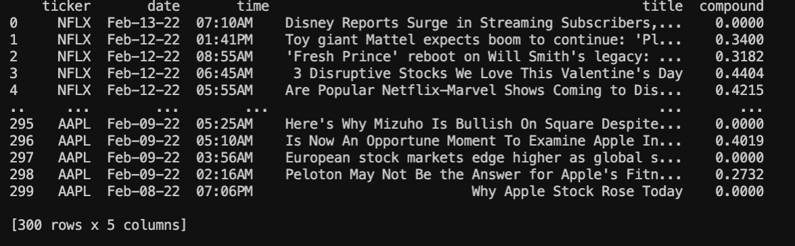
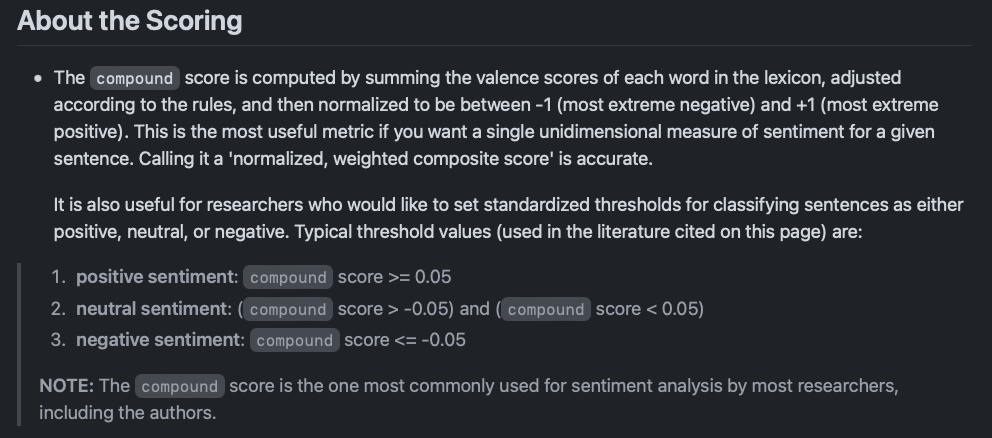
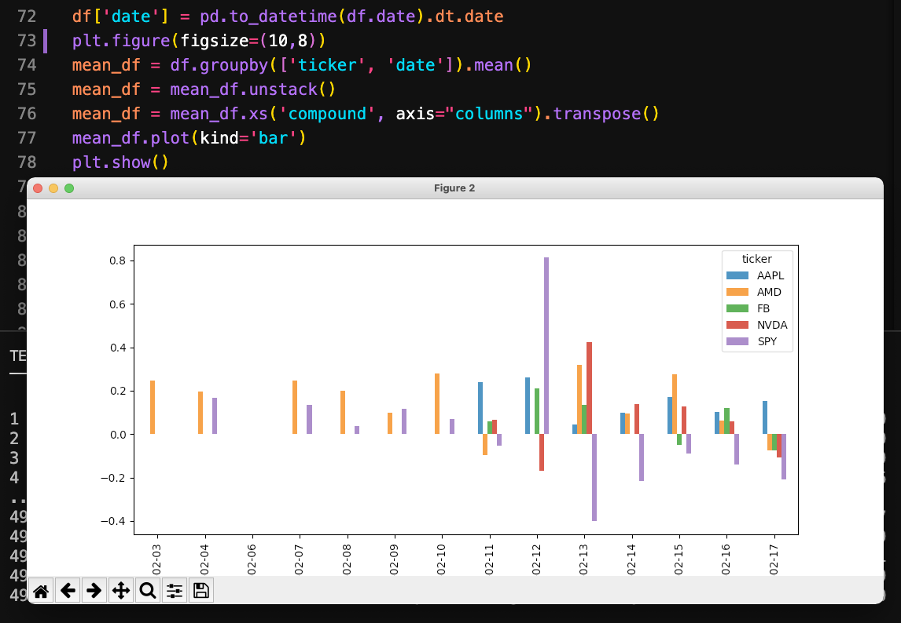
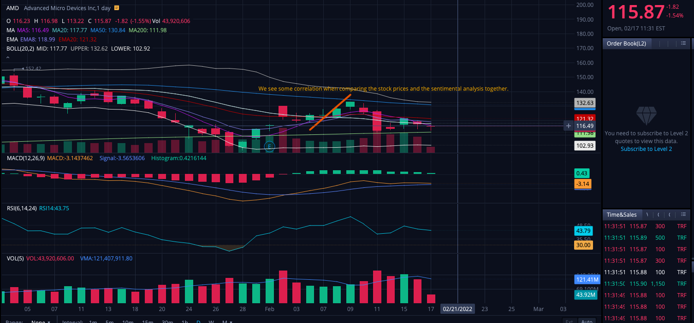

# A script that analyzes the sentiment of news articles of stocks on FinViz.

### We'll learn how to use the Requests module in Python, get the HTML returned in BeautifulSoup and parse the Article Data, apply Sentiment Analysis on the data with NLTK, and finally visualize the results of our data frame in Pandas with MatPlotLib.

# DataFrame

# About Scoring

# Visualizing The Data

# Comparing the Data to actual stock prices
## If we compare for example AMD's analysis to its stock price we see a relative correlation in the regards of sentimental analysis. If we compare the dates from 02-03 on the sentimental analysis chart with the stock chart we see a positive sentiment thus correlating with the stock price. We can also observe on 02-11 AMD fell from a price of $127.17 to a low of $111.81, and if we compare that drop with the sentiment analysis on the same day we see a negative sentiment in correlation with each other. 

